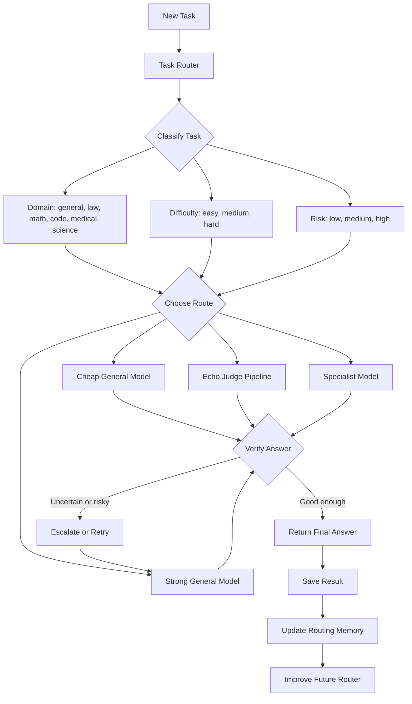

# Echo Router And Learning Loop

## Purpose

This document explains the next direction for Echo: moving from a simple judge-based routing system to a smarter router that can send different tasks to different models, then learn from the results over time.

The core goal is:

> Send each task to the cheapest model that is likely to answer correctly.

That means we do not always want the strongest model. We want the right model for the task.

## Current Echo Routing

Current Echo works like this:

```text
Task
  -> cheap model answer A
  -> cheap model answer B
  -> judge compares A and B
  -> if they agree, accept cheap answer
  -> if they disagree, escalate to stronger model
```

In the current harness:

- cheap model path: Haiku-style calls
- strong model path: Sonnet
- judge: Claude/OpenAI/Gemini/local judge depending on the arm

Example:

```text
Question: What is the answer?

Haiku persona A: Answer B
Haiku persona B: Answer B
Judge: They agree
Final: use cheap answer
```

Harder example:

```text
Law question

Haiku persona A: Answer A
Haiku persona B: Answer C
Judge: They disagree
Final: escalate to Sonnet
```

This is useful, but it is reactive. Echo first spends cheap model calls, then decides whether to escalate.

The next version should be more proactive:

```text
Look at the task first, then choose the best route.
```

## High-Level Flowchart



Plain-English version:

```text
Task comes in
  -> router checks domain, difficulty, and risk
  -> router chooses cheap model, Echo, specialist, or strong model
  -> answer is verified
  -> if answer looks unsafe, escalate
  -> save result
  -> use saved results to improve future routing
```

## Why A Router Is Needed

Different tasks need different kinds of models.

Some tasks are easy:

```text
Short general question -> cheap general model
```

Some tasks are hard:

```text
Long reasoning question -> stronger model
```

Some tasks are specialized:

```text
Law question -> legal specialist
Math question -> math specialist
Coding question -> code specialist
Medical question -> biomedical specialist
```

So the router should not only ask:

```text
Is this easy or hard?
```

It should also ask:

```text
What domain is this task?
Which model is best for that domain?
How risky is it to use a cheap model?
```

## Router As A Traffic Controller

Think of the router like a hospital receptionist.

The receptionist does not send everyone to the same doctor.

```text
Cold -> general doctor
Heart problem -> heart specialist
Tooth problem -> dentist
Emergency -> senior doctor
```

The Echo router should do the same:

```text
Easy general question -> Haiku
Law question -> legal specialist or Sonnet
Math question -> math specialist or Echo
Hard unknown question -> Sonnet
Uncertain question -> Echo judge pipeline
```

## Proposed Router Output

The router should produce a structured decision.

Example:

```json
{
  "domain": "law",
  "difficulty": "hard",
  "route": "legal-specialist",
  "fallback": "sonnet",
  "reason": "The task contains legal doctrine terms and law was weak for cheap general models."
}
```

Another example:

```json
{
  "domain": "general",
  "difficulty": "easy",
  "route": "haiku-only",
  "fallback": "none",
  "reason": "The task is short and historically cheap models perform well on similar tasks."
}
```

## Router Levels

The router can be built in stages.

## Level 1: Rule-Based Router

This is the simplest first version.

Rules can use:

- benchmark name
- category
- question length
- number of choices
- keywords
- math symbols
- historical category performance

Example:

```python
def route_task(task):
    category = task.get("category")
    question = task.get("question", "")

    if category == "law":
        return "legal-specialist"

    if category == "math":
        return "math-specialist"

    if len(question) < 120:
        return "haiku-only"

    return "echo-judge"
```

This is easy to explain, easy to debug, and good for a first baseline.

## Level 2: Complexity-Aware Router

This version looks not only at category, but also task complexity.

Features:

- question length
- option count
- number of numbers
- math symbols
- code blocks
- legal/medical/science keywords
- whether the task has negation or tricky wording

Example:

```text
category = law
question length = long
legal keywords = yes
difficulty = hard
route = legal specialist or Sonnet
```

This gives finer control than simple category rules.

## Level 3: LLM Router

An LLM can classify the task.

Prompt:

```text
You are a model router.
Classify the task by domain and difficulty.
Choose the cheapest route likely to answer correctly.
Return JSON only.
```

Output:

```json
{
  "domain": "math",
  "difficulty": "medium",
  "route": "math-specialist",
  "fallback": "sonnet"
}
```

This is flexible, but harder to evaluate because the router itself can make mistakes or be inconsistent.

## Level 4: Learned Cost-Aware Router

This is the strongest long-term version.

It learns from past benchmark results.

For every task, we save:

```text
task_id
benchmark
category
question text
route used
model/arm used
passed or failed
cost
sub_calls
latency
failure reason
```

Then we ask:

```text
Which route was the cheapest route that still got the task correct?
```

That becomes the training label.

Example:

```text
Task: chemistry question
Haiku: correct, cost 1
Sonnet: correct, cost 3
Echo: correct, cost 3

Best route: Haiku
```

Another example:

```text
Task: law question
Haiku: wrong
Echo: wrong
Sonnet: correct
Legal specialist: correct, cheaper than Sonnet

Best route: Legal specialist
```

Training data:

```text
task features -> best route
```

Then the learned router predicts the best route for new tasks.

## Cost-Aware Decision

The router should not only maximize accuracy. It should balance accuracy and cost.

A simple formula:

```text
score = predicted_probability_correct - lambda * cost
```

Where `lambda` controls how much we care about cost.

Example:

```text
Haiku:
probability correct = 0.70
cost = 1
score = 0.70 - 0.05 * 1 = 0.65

Sonnet:
probability correct = 0.88
cost = 3
score = 0.88 - 0.05 * 3 = 0.73

Route: Sonnet
```

If Sonnet is more expensive:

```text
Sonnet:
probability correct = 0.88
cost = 6
score = 0.88 - 0.05 * 6 = 0.58

Route may become Haiku or Echo instead.
```

This is why it is called cost-aware. It does not blindly choose the strongest model.

## Specialist Models

Specialist models are domain-specific helpers.

Examples:

```text
law -> legal reasoning model
math -> math reasoning model
coding -> code model
medical -> biomedical model
science -> STEM model
philosophy -> logic/philosophy model
```

The MMLU-Pro pilot already showed why this matters.

Law results:

```text
haiku-only: 20%
sonnet-only: 60%
echo-judge: 40%
echo-oracle: 60%
```

This means:

- cheap general model struggled,
- Sonnet helped,
- Echo improved over Haiku but stayed below Sonnet,
- oracle showed better routing can help.

So law is a good first candidate for specialist routing.

## Agentic Echo

The router can become more like an agent if it has a loop:

```text
observe -> decide -> act -> evaluate -> remember -> improve
```

In Echo terms:

```text
observe: read the task
decide: choose model route
act: call selected model
evaluate: check answer quality
remember: save result
improve: update routing policy over time
```

Agentic Echo is different from current Echo.

Current Echo:

```text
Try cheap answers first, then judge agreement.
```

Agentic Echo:

```text
Look at task first.
Use history to choose a route.
Verify the answer.
Escalate if needed.
Save the outcome.
Improve future routing.
```

## Learning Loop

The learning loop is the most important part.

## Step 1: Run Benchmarks

Run multiple arms on the same tasks:

```text
haiku-only
sonnet-only
echo-judge
echo-oracle
specialist-router
```

## Step 2: Save Results

Save JSONL rows with:

```text
task_id
category
arm
passed
cost
sub_calls
latency
failure detail
```

## Step 3: Analyze Outcomes

For each task, identify:

```text
Which arms passed?
Which arm was cheapest?
Which route had false accepts?
Which categories failed?
```

## Step 4: Create Training Labels

For each task:

```text
label = cheapest correct route
```

If no route passed:

```text
label = needs stronger model / unresolved
```

## Step 5: Train Router

Train a simple classifier first:

```text
features -> best route
```

Possible models:

- logistic regression
- random forest
- gradient boosted trees
- small transformer classifier
- LLM router later

Start simple. Explainability matters.

## Step 6: Deploy Router In Harness

Add a new arm:

```text
learned-router
```

The arm:

1. extracts task features,
2. predicts route,
3. calls selected model,
4. optionally verifies answer,
5. escalates if uncertain.

## Step 7: Keep Improving

Every new run adds more data.

The router improves as the dataset grows:

```text
more benchmark results -> better routing labels -> better router
```

## Evaluation Metrics

The router should be evaluated with:

- pass rate
- cost per task
- escalation rate
- latency
- false accept rate
- false escalation rate
- category-level performance
- gap versus Sonnet
- gap versus oracle

Important:

The best router is not simply the cheapest router.

The best router is the one that keeps accuracy high while reducing unnecessary expensive calls.

## First Implementation Plan

The practical first version should be:

```text
Hybrid rule-based router + memory from results
```

It should:

1. use MMLU-Pro category,
2. use question complexity features,
3. use previous category performance,
4. route obvious easy tasks to Haiku,
5. route weak categories like law to Sonnet or specialist,
6. use Echo judge when uncertain,
7. save all outcomes for future learning.

Suggested first routes:

```text
chemistry/physics, easy -> Haiku or Echo
law -> legal specialist or Sonnet
philosophy -> Echo with stronger judge or philosophy specialist
math -> Echo first, specialist if larger sweep shows weakness
unknown hard -> Sonnet
```

## Research Questions

The router lets us ask stronger questions:

1. Can routing match Sonnet accuracy at lower cost?
2. Which categories need specialist models?
3. Can a learned router beat a rule-based router?
4. Can specialist routing beat general escalation?
5. Which judge family gives the safest routing decisions?
6. How much data is needed before the router learns useful patterns?

## Short Summary

Current Echo checks whether two cheap answers agree.

The next Echo router should decide where to send the task before solving it.

The long-term system should learn from benchmark results:

```text
task -> route -> result -> memory -> better future route
```

That turns Echo from a fixed routing trick into an adaptive model-routing agent.
